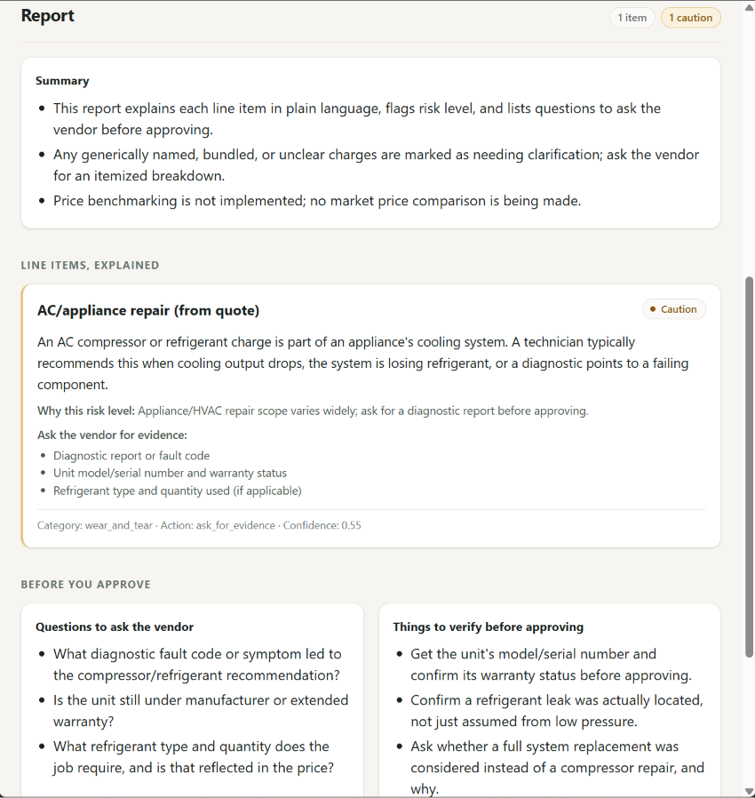

# QuoteCheck — Service Quote Review Assistant

QuoteCheck helps you turn messy service, maintenance, repair, parts, and vendor
quotes into a structured review before you approve them: what each quoted charge
appears to mean, what is vague or confusing, what evidence you should request, what
to ask the vendor before approval, and what remains uncertain.

> Disclaimer: **Not safety advice; verify with a qualified professional.** This is an
> early-stage implementation — see [Limitations](#limitations) below.

## What it is, who it helps, why it exists

You get a quote from a garage, contractor, appliance technician, or other vendor. The
line items are vague ("labour", "misc charges"), you don't know which ones are
safety-critical vs. optional, and you don't know what to ask before you say yes.
QuoteCheck is for that moment: paste the quote text in, and get back an
**explanation-first** report — what each item is, why it might be recommended, what's
risky or bundled/unclear, and concrete questions to send back to the vendor. It
exists to help someone understand and question a quote, not to replace the
professional who ultimately signs off on it.

The OpenAI analysis path and its prompt are domain-generic across service, repair,
maintenance, parts, and vendor quotes. The deterministic Demo analyzer (below) is
narrower: its heuristics and the shared result taxonomy still carry vehicle-era
wording. `SPEC.md` describes the broader target.

### What QuoteCheck does not do

QuoteCheck does **not** benchmark market prices, judge whether a quoted price is
objectively fair, determine vendor trustworthiness, or verify vendor claims against
external authoritative data. It does not replace qualified professional advice.

---

## Try it in under a minute (no API key needed)

QuoteCheck's default mode is a deterministic, zero-cost **Demo mode**
(`QUOTECHECK_USE_OPENAI=0`) — no `backend/.env` file and no OpenAI API key required.
Real OpenAI calls are opt-in — see [Demo mode vs. OpenAI mode](#demo-mode-vs-openai-mode).

### Prereqs

- Python 3.10+ (there is no committed `environment.yml`/lockfile yet, only a pinned
  `backend/requirements.txt`; see [Limitations](#limitations))
- Node 18+ / npm
- WSL2 Ubuntu 22 works great

### 0) Clone

```bash
git clone https://github.com/akshayv177/quotecheck-v0
cd quotecheck-v0
```

### 1) Backend

From repo root:

```bash
python3 -m venv .venv
source .venv/bin/activate      # Windows: .venv\Scripts\activate
pip install -r backend/requirements.txt
QUOTECHECK_USE_OPENAI=0 uvicorn backend.app:app --reload --host 0.0.0.0 --port 8000
```

`QUOTECHECK_USE_OPENAI=0` is already the default even without setting it explicitly (no
`backend/.env` needed) — it's shown here so it's obvious at a glance that this command
cannot make a paid OpenAI call. Prefer conda? `conda create -n quotecheck python=3.11 -y
&& conda activate quotecheck` works the same way in place of the `venv` step above.

Sanity check (in another terminal, with the backend still running):

```bash
curl http://localhost:8000/health
```

Analyze a sample quote in Demo mode without opening the frontend (run this from the
repo root — it reads `examples/quote_ac_repair.txt` as a relative path):

```bash
curl -s -X POST http://localhost:8000/analyze -H "Content-Type: application/json" \
  -d "$(python3 -c 'import json; print(json.dumps({"quote_text": open("examples/quote_ac_repair.txt").read()}))')"
```

### 2) Frontend

In another terminal:

```bash
cd frontend
npm install
npm run dev -- --host
```

Open the URL Vite prints (usually `http://localhost:5173`) → the textarea is
pre-filled with a sample quote → click **Analyze quote** → see the full
quote-understanding report, with a **"Demo mode"** badge next to the run metadata
confirming no OpenAI call was made.

---

## What a report looks like

Input ([`examples/sample_quote.txt`](examples/sample_quote.txt)):

```
Brake pads replacement recommended. Tyre rotation. Shop supplies / misc service charge included.
```

Excerpt of the real Demo-mode response (full file:
[`examples/sample_output.json`](examples/sample_output.json) — `request_id`,
`created_at`, and `latency_ms` will differ on your machine/run):

```json
{
  "name_raw": "Brake service/ pads (from quote)",
  "explanation": "Brake pads are the friction material that presses on the rotor to slow the vehicle. A shop typically recommends replacement when pad thickness drops below a safe threshold or the rotor shows wear.",
  "risk_level": "red",
  "recommended_action": "needs_inspection",
  "vague_or_confusing": false,
  "evidence_needed": ["Pad thickness measurement (mm)", "Rotor condition photo", "Reason for replacement"]
}
```

The third line item ("Shop supplies / misc service charge") comes back with
`"vague_or_confusing": true` — QuoteCheck flags generic/bundled charges instead of
silently passing them through. Every response also includes `overall_summary`,
`verification_questions` ("questions to ask the vendor"), `things_to_verify`, explicit
`uncertainty_markers`, and a mandatory disclaimer.

More sample reports — vehicle service, AC/appliance repair, home maintenance/
contractor, a vague-charges parts quote, and a genuinely vague quote — are in
[`examples/README.md`](examples/README.md), each a real captured Demo-mode response.

## Screenshot



---

## Demo mode vs. OpenAI mode

Local settings and secrets live in an untracked `backend/.env` file. You do **not**
need to create one to try Demo mode — it's the default. Create one only if you want
to switch to OpenAI mode:

1. Copy the example:

```bash
cp backend/.env.example backend/.env
```

2. Edit `backend/.env`:

Demo mode — deterministic stub analyzer, default, zero cost, no key required
* `QUOTECHECK_USE_OPENAI=0`

OpenAI mode — real model calls, requires a key
* `QUOTECHECK_USE_OPENAI=1`
* `OPENAI_API_KEY=your_key_here`
* `QUOTECHECK_MODEL=gpt-4o-mini`

The frontend badge and the `metadata.model` field in every `/analyze` response
reflect whichever mode actually served the request (`quotecheck-demo-analyzer` in
Demo mode, the configured `QUOTECHECK_MODEL` in OpenAI mode) — so it's never
ambiguous which one produced a given report. The committed
[`examples/sample_output.json`](examples/sample_output.json) is a real Demo-mode
response; no OpenAI call was made to produce it.

> `backend/.env` is gitignored. Never commit secrets.

---

## API

### `POST /analyze`

Request:

```json
{ "quote_text": "Brake pads replacement recommended. Tyre rotation." }
```

Response: **QuoteCheckResult** (schema-valid JSON) — see
[`examples/sample_output.json`](examples/sample_output.json) for a full real example.

* `line_items[]` — category, plain-English `explanation`, `vague_or_confusing` flag,
  risk level, confidence, short rationale, evidence needed
* `overall_summary[]`
* `verification_questions[]` ("questions to ask the vendor")
* `things_to_verify[]`
* `uncertainty_markers`
* `metadata` (request_id, prompt_version, model, created_at, latency_ms, schema_valid)

---

## Architecture

```
React/Vite SPA
  |
  |  POST /analyze  (JSON)
  v
FastAPI backend
  - assigns request_id, measures latency
  - Pydantic QuoteCheckResult contract
  - runs ONE analyzer, selected by configuration (QUOTECHECK_USE_OPENAI):
      deterministic Demo analyzer   (default)
        OR
      OpenAI Responses API          (opt-in)
  - validates the result, attaches metadata, appends a JSONL trace
  |
  v
Pydantic QuoteCheckResult  ->  logs/app_runs.jsonl (append-only)  ->  frontend report
```

Analyzer mode is chosen once by configuration, not negotiated per request. An
OpenAI-path failure returns an error to the caller; it does **not** silently switch
to Demo output.

Every `/analyze` call appends one JSON line to `logs/app_runs.jsonl` (request_id,
prompt_version, model, latency_ms, schema_valid, risk_counts, uncertainty, error).
Inspect the latest entry:

```bash
tail -n 1 logs/app_runs.jsonl | python3 -m json.tool
```

Prompt artifacts live in `backend/core/prompt.py`; `PROMPT_VERSION`
(`quotecheck_v0.4`) is included in both API responses and run logs so prompt changes
are traceable as versioned product changes.

### OpenAI mode

When `QUOTECHECK_USE_OPENAI=1`, `/analyze` calls the **OpenAI Responses API** with
**Structured Outputs**: a strict JSON Schema generated from the Pydantic
`QuoteCheckResult` contract (`backend/core/schema_export.py`). The model response is
then re-validated with Pydantic before it is returned. The default configured model
is `gpt-4o-mini` (`QUOTECHECK_MODEL`). There is no multi-provider abstraction — this
is an OpenAI-only path.

### Demo mode

The default (`QUOTECHECK_USE_OPENAI=0`) is a deterministic keyword-heuristic analyzer
(`backend/core/stub_analyzer.py`). It makes no network or model calls, costs nothing,
needs no OpenAI key or `backend/.env`, and always reports
`metadata.model = "quotecheck-demo-analyzer"`. It exists for local and public
reproducibility — anyone can clone the repo and get a real, schema-valid response
without an API key or model call. It is heuristic, not model-intelligent: it
recognizes a small fixed set of keywords per domain and is **not** equivalent to
OpenAI-mode output.

### Evaluation

The repo ships six real, captured cross-domain Demo-mode example outputs
(`examples/`), and any `/analyze` response can be validated against the
`QuoteCheckResult` schema. Manual QA has been performed historically and recorded in
the ticket/review bundles under `docs/`. There is **no automated eval or regression
harness yet** — no scored semantic evaluation, no CI.

---

## What works today

- Backend + frontend run locally; `/analyze` returns a schema-valid,
  explanation-first result in both Demo mode (no API key) and OpenAI mode.
- React UI renders a full quote-understanding report: explanation-first line-item
  cards, risk badges, a "needs clarification" badge for vague/bundled charges,
  evidence-needed lists, vendor questions, things to verify, a Demo/OpenAI mode
  badge, staged progress + elapsed-time feedback while a request is in flight, a
  client-side 55s timeout, and failure-specific error messages.
- JSONL run logging + prompt version discipline.
- Config via `.env` (untracked) with safe defaults; secrets never committed.

---

## Limitations

- Not production-ready: no auth, no database, no persistence beyond the local JSONL
  log, no SLAs, no hardening, no production-scale monitoring or load testing.
- Paste-text input only — no PDF/OCR/image ingestion.
- No market-price benchmarking, and no objective price-fairness judgment — QuoteCheck
  describes only what the quote itself states.
- No vendor verification: QuoteCheck does not check vendor claims against external
  authoritative sources or assess vendor trustworthiness.
- The deterministic Demo analyzer is a narrow keyword heuristic; its heuristics and
  the shared `NormalizedCategory` taxonomy still carry vehicle-era wording. The
  OpenAI-mode prompt itself is domain-generic.
- No persistent user history or accounts.
- No automated semantic eval / regression harness (`docs/CURRENT_STATE.md` has the
  full gap list).
- No repair/retry when model output fails schema validation.
- No committed `environment.yml`/lockfile — only a pinned `backend/requirements.txt`;
  reproducibility relies on activating a compatible Python 3.10+ environment yourself.
- QuoteCheck does not verify vendor claims, guarantee fair pricing, or replace a
  qualified professional's judgment.

For a full, neutral summary of what's public-ready vs. still limited, see
[`docs/PROJECT_STATUS.md`](docs/PROJECT_STATUS.md). To run it yourself and confirm
it works end to end, see [`docs/LOCAL_DEMO.md`](docs/LOCAL_DEMO.md). For real
captured sample reports, see [`examples/README.md`](examples/README.md).

---

## Design notes

A few deliberate choices in this early implementation:

- **Schema-first API responses** (Pydantic) — the UI and any future analyzer are
  bound to the same validated shape, not to whatever a prompt happens to return.
- **Deterministic demo mode** — `metadata.model = "quotecheck-demo-analyzer"` in
  Demo mode, never an OpenAI model name, so the UI badge and JSONL logs can't
  accidentally overstate what produced a result.
- **Optional OpenAI mode** — opt-in, requires `backend/.env` with
  `OPENAI_API_KEY`; see [Demo mode vs. OpenAI mode](#demo-mode-vs-openai-mode).
- **Reviewable report sections** — explanation, risk, vendor questions, and
  things to verify are separate, structured fields, not a single free-text blob.
- **JSONL request logs** — every request is a traceable record (request_id,
  prompt version, latency, schema validity, risk counts) in
  `logs/app_runs.jsonl`.
- **Honest limitations, stated plainly** rather than glossed over, per `SPEC.md`
  and [`docs/PROJECT_STATUS.md`](docs/PROJECT_STATUS.md).

---

## Repo structure (high level)

```
backend/
  app.py
  core/
    schema.py
    prompt.py
    schema_export.py
    run_logger.py
    config.py
    stub_analyzer.py
    openai_analyzer.py
  .env.example
  requirements.txt

frontend/
  src/App.jsx

examples/
  README.md
  sample_quote.txt
  sample_output.json
  quote_vehicle_service.txt
  quote_ac_repair.txt
  quote_home_maintenance.txt
  quote_parts_labour_misc.txt
  quote_vague_missing_details.txt
  outputs/
    vehicle_service.json
    ac_repair.json
    home_maintenance.json
    parts_labour_misc.json
    vague_missing_details.json

logs/
  app_runs.jsonl

docs/
  tickets/    (one file per unit of work)
  review/     (review bundle per ticket, with real command output)
  assets/     (quotecheck-ui.png — committed UI screenshot)
  CURRENT_STATE.md    (factual snapshot of what exists right now)
  PROJECT_STATUS.md   (what's public-ready vs. still limited)
  LOCAL_DEMO.md       (local run guide: start backend/frontend, verify it works)
```

---

## Roadmap

1. Add bounded repair retry (if model output fails Pydantic validation)
2. Eval harness: 10–20 quotes -> JSONL results + summary.md metrics
3. Cost controls: output token caps, shorter rationales, caching hooks, batch eval runs
4. Product wedge: expanded taxonomy + evidence requirements + HITL workflows

---

## License

MIT
